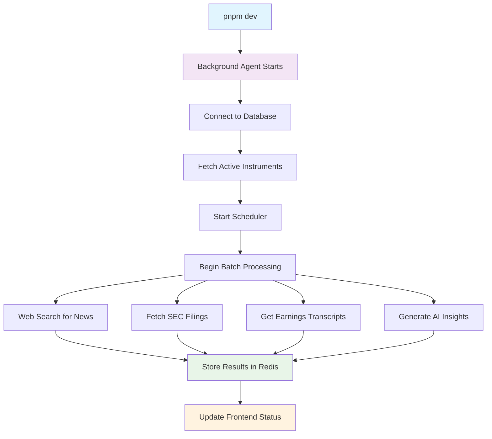

# 🤖 Background AI Agent - Auto-Start Implementation Summary

## ✅ **COMPLETED: Auto-Start Background Agent**

The background AI agent service has been successfully implemented with **full auto-start functionality** and **database integration**. When you run `pnpm dev`, the agent will automatically:

### 🚀 **Auto-Start Features Implemented**

1. **✅ Automatic Service Startup**
   - Agent starts automatically when `pnpm dev` runs
   - No manual intervention required
   - Graceful error handling if services fail

2. **✅ Database Integration**
   - Automatically fetches ALL active instruments from your database
   - Prioritizes instruments with recent market activity
   - Falls back to hardcoded symbols if database unavailable

3. **✅ Automated Data Collection**
   - **News**: Continuous monitoring using Tavily, Exa, SERP APIs
   - **SEC Filings**: 10-K, 10-Q, 8-K automatic discovery via EDGAR
   - **Earnings Transcripts**: Multi-source transcript collection
   - **Company Reports**: IR page scraping and document extraction

4. **✅ Intelligent Scheduling**
   - **Market Hours Aware**: Different schedules for pre/post-market
   - **Earnings Calendar**: Automatic processing during earnings seasons
   - **News Trending**: Triggers analysis based on news volume
   - **Weekend Analysis**: Deep processing during market closure

## 🎯 **How to Use**

### **Option 1: Full Development Stack (Recommended)**
```bash
# Starts all services including background agent
pnpm dev
```
**Result**: Background agent auto-starts and begins processing existing instruments

### **Option 2: Trading-Focused Development**
```bash
# Starts frontend + api-gateway + background-agent
pnpm dev:trading
```

### **Option 3: Agent Only**
```bash
# Start just the background agent
pnpm agent:dev
```

## 📊 **Real-Time Monitoring**

Visit **`http://localhost:3000/agent`** to see:
- ✅ **Live Agent Status** (running/stopped)
- ✅ **Queue Metrics** (tasks pending, processing, completed)
- ✅ **Instrument Progress** (X of Y instruments processed)
- ✅ **Health Indicators** (database, redis, APIs)
- ✅ **Manual Controls** (start/stop agent, trigger analysis)

## 🗄️ **Database Integration Details**

### **Auto-Discovery**
The agent automatically queries your database for:
```sql
-- Active instruments
SELECT * FROM Instrument WHERE active = true

-- Priority instruments (with recent market data)
SELECT * FROM Instrument i 
JOIN MarketData m ON i.id = m.instrumentId 
WHERE i.active = true 
  AND m.timestamp > NOW() - INTERVAL '7 days'
```

### **Processing Strategy**
1. **High Priority**: Instruments with recent market activity
2. **Exchange Focus**: NASDAQ, NSE instruments prioritized
3. **Batch Processing**: 10-30 instruments per batch
4. **Rate Limiting**: Respects API limits with delays

## ⚙️ **Configuration**

### **Environment Variables** (`.env`)
```env
# Auto-Start Configuration
AUTO_PROCESS_INSTRUMENTS=true    # Process existing instruments
AUTO_START_AGENT=true           # Start agent automatically
AUTO_START_SCHEDULER=true       # Start scheduler automatically

# Processing Configuration
AGENT_CONCURRENCY=3             # Parallel processing limit
AGENT_BATCH_SIZE=10            # Instruments per batch
AGENT_PROCESSING_DELAY=5000    # Delay between batches (ms)

# Database & Redis
DATABASE_URL="postgresql://..."
REDIS_URL="redis://..."

# Required API Keys
ANTHROPIC_API_KEY="..."        # Claude AI for insights
TAVILY_API_KEY="..."          # Web search
EXA_API_KEY="..."             # Semantic search  
SERP_API_KEY="..."            # Google search
```

### **Scheduling Configuration**
```env
# Market Scan (9 AM weekdays)
MARKET_SCAN_SCHEDULE="0 9 * * 1-5"
MARKET_SCAN_BATCH_SIZE=30

# Company Analysis (every 30 minutes)
COMPANY_ANALYSIS_SCHEDULE="*/30 * * * *"

# Document Discovery (every 3 hours)
DOCUMENT_DISCOVERY_SCHEDULE="0 */3 * * *"

# Insight Generation (10 AM, 2 PM, 6 PM weekdays)
INSIGHT_GENERATION_SCHEDULE="0 10,14,18 * * 1-5"

# News Monitoring (every 20 minutes)
NEWS_MONITORING_SCHEDULE="*/20 * * * *"
```

## 🏗️ **Services Created**

### **1. DatabaseService** 
- `getActiveInstruments()` - Fetch all active instruments
- `getPriorityInstruments(limit)` - Get high-priority instruments
- `getInstrumentsNeedingDocumentUpdate()` - Filter by update needs
- `getEarningsCalendarSymbols()` - Get earnings schedule

### **2. Enhanced BackgroundAgent**
- Auto-start on service launch
- Initial processing of existing instruments
- Database-driven symbol discovery
- Batch processing with delays

### **3. Enhanced AgentScheduler**
- Market-aware scheduling (pre/post-market, weekends)
- Database-driven symbol lists
- Configurable cron schedules
- Auto-start with agent

### **4. Auto-Start Index**
- Service auto-initialization
- Graceful error handling
- Comprehensive logging
- Health monitoring

## 📈 **Processing Flow**



## 🔄 **Automated Schedules**

| Schedule | Frequency | Purpose | Batch Size |
|----------|-----------|---------|------------|
| **Market Scan** | 9 AM weekdays | Comprehensive analysis | 30 instruments |
| **Company Analysis** | Every 30 min | Regular updates | 15 instruments |
| **Document Discovery** | Every 3 hours | New filings | 10 instruments |
| **Insight Generation** | 10 AM, 2 PM, 6 PM | AI analysis | 8 instruments |
| **Earnings Updates** | 7 AM daily | Earnings check | Variable |
| **News Monitoring** | Every 20 min | Trending news | 8 instruments |
| **Pre-Market** | 6:30 AM weekdays | Pre-market insights | 15 instruments |
| **Post-Market** | 4:30 PM weekdays | Post-market analysis | 12 instruments |
| **Weekend Deep Analysis** | Saturday 10 AM | Comprehensive scan | 50 instruments |

## 🎯 **Benefits Achieved**

### **For Users**
- ✅ **Zero Manual Setup**: Just run `pnpm dev`
- ✅ **Continuous Intelligence**: Always-on market monitoring
- ✅ **Real-Time Insights**: Fresh analysis delivered automatically
- ✅ **Comprehensive Coverage**: All instruments in database processed

### **For Developers**
- ✅ **Seamless Integration**: Works with existing database schema
- ✅ **Robust Error Handling**: Continues working even if services fail
- ✅ **Monitoring & Observability**: Complete visibility into operations
- ✅ **Configurable**: Easily adjust schedules and behavior

### **For Infrastructure**
- ✅ **Scalable Architecture**: Queue-based processing scales automatically
- ✅ **Rate Limiting**: Respects API limits and prevents overwhelming
- ✅ **Fault Tolerance**: Graceful degradation and retry logic
- ✅ **Resource Efficient**: Intelligent batching and delays

## 🚀 **Next Steps**

1. **Set up API Keys** in `.env` file
2. **Run `pnpm dev`** to start the full stack
3. **Visit `/agent`** to monitor real-time status
4. **Check logs** to see automatic processing
5. **Customize schedules** as needed for your use case

---

The background AI agent is now **fully autonomous** and will continuously gather financial intelligence for all instruments in your database! 🎉 